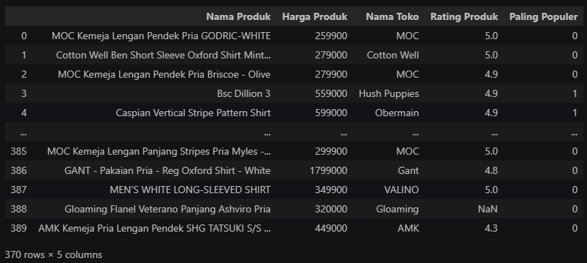
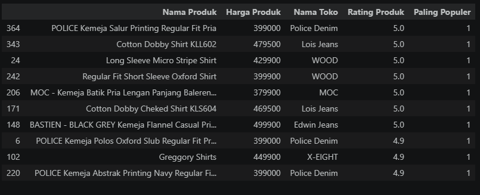

# Automated Web Scraping for Smart Shopping: Shirt Selection Project

## Project Overview
This project automates the process of searching for shirt products on e-commerce platforms using Web Scraping techniques. The main objective is to assist in purchasing decisions by automatically filtering data based on price, popularity, and ratings..

## Repository Structure
```
├── P1_Adhi-Rizqi.ipynb   # Main Notebook (scraping & analysis process)
├── datamatang.db         # Scraped database (SQLite)
├── datamatang.sql        # SQL Export file
└── README.md             # Project documentation
```

## Background (Case Study)
The project was born from a personal need to purchase new shirts for multiple events in a single week. The challenge was to find the best shirts based on specific criteria:
- `Category`: Most Popular.
- `Budget`: Under IDR 500,000.
- `Quality`: Highest user ratings.

## Workflow & Technology
The project follows these key stages:
- `Extraction`: Utilizing Selenium and BeautifulSoup to capture dynamic web data.
- `Preparation`: Data cleaning and structuring using Pandas.
- `Storage`: Exporting the processed data into relational databases (SQLite) in both .db and .sql formats.
Tech Stack:
- `Language`: Python
- `Libraries`: Selenium, BeautifulSoup4, Pandas, Requests.
- `Database`: SQLite3.

## Key Features
- `Automated Scraping`: Extracts product names, prices, brands, ratings, and popularity labels.
- `Data Filtering`: Automatically filters products that fit the user's budget and quality requirements.
- `Export Ready`: Data is neatly stored in SQL format, ready for integration with other systems.

## Results & Recommendations



Based on the program execution, the top recommendations found are:
- `Top Choice`: EQ Zed solid RXD ss STREET (IDR 299,900 | Rating 4.9).
- `Alternatives`: LUCAS REG LINEN LS SHIRT and ELLIOT OVZ LS (Price < IDR 500,000).

## How to Use
1. Clone this repository.
2. Ensure you have the appropriate webdriver installed (e.g., ChromeDriver).
3. Install the required libraries:
   `pip install selenium beautifulsoup4 pandas requests`
4. Run the `P1_Adhi-Rizqi.ipynb notebook`.

## Contact
For questions or collaboration, please contact Adhi Rizqi Alfaqih via [LinkedIn](https://www.linkedin.com/in/adhirizqi/) or GitHub.
