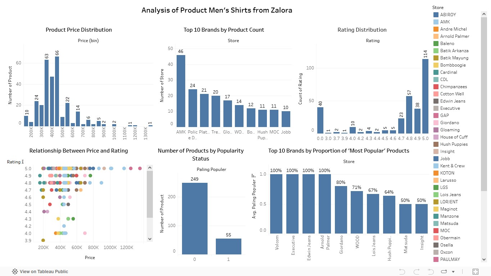

# Zalora Men's Shirt Data Analysis

## Project Overview
This project analyzes men's shirt products available on the Zalora e-commerce platform using web scraping and data analysis techniques. The objective of this project is to explore product characteristics such as price distribution, customer ratings, and brand popularity, and to generate product recommendations based on specific criteria.

The analysis combines **Python for data processing and Tableau for visualization**, demonstrating a typical workflow used in data analytics projects.

## Problem Statement
I needed to purchase several shirts for upcoming events within a week while keeping my spending within a limited budget. Therefore, data analysis was used to identify the most suitable products based on specific criteria.

The product selection criteria are:

- The product must be categorized as **"Most Popular"**
- The product price must be below **IDR 500,000**
- The product must have a **high customer rating**

## Tools & Technologies
The following tools and technologies were used in this project:

- **Python** → Web scraping and data processing
- **Selenium** → Browser automation for extracting product data
- **BeautifulSoup** → HTML parsing and data extraction
- **Pandas** → Data cleaning and analysis
- **Matplotlib** / Seaborn → Data visualization during EDA
- **Tableau** → Interactive dashboard creation

## Project Workflow
The project was conducted through the following stages:

1. **Web Scraping**

Product data was collected from the Zalora website using **Selenium and BeautifulSoup**.

2. **Data Cleaning**

The dataset was cleaned by handling missing values, correcting data types, and ensuring the data was suitable for analysis.

3. **Exploratory Data Analysis (EDA)**

EDA was conducted to explore and understand the dataset, including price distribution, customer ratings, and product popularity across different brands.

4. **Data Filtering**

The dataset was filtered based on predefined criteria to identify the most suitable product recommendations.

5. **Data Visualization**

An interactive dashboard was created using **Tableau** to visually present the analysis results.

## Exploratory Data Analysis
Several analyses were conducted to understand the dataset.

- **Price Distribution**

The price distribution analysis shows that most shirt products fall within the **IDR 300,000 to IDR 500,000** price range, indicating that the category is dominated by mid-range priced products.

- **Product Rating Distribution**

Most products have ratings above **4.0**, suggesting a generally high level of customer satisfaction for men's shirt products on the platform.

- **Brand Popularity**

Some brands have a higher proportion of products categorized as **"Most Popular"**, indicating stronger customer interest or visibility for those brands on the platform.

## Filtering Results
After the data cleaning and analysis process, product filtering was performed based on the following criteria:

- Product price below **IDR 500,000**
- Product categorized as **Most Popular**
- Product with **high customer ratings**

The analysis produced the **Top 10 recommended men's shirt products** based on the highest customer ratings.


## Dashboard Preview


## Tableau Dashboard
The interactive dashboard can be explored here:

**Tableau Public Link**
[Dashboard](https://public.tableau.com/views/AnalysisofProductMensShirtsfromZalora/Dashboard1?:language=en-US&publish=yes&:sid=&:redirect=auth&:display_count=n&:origin=viz_share_link)

## Conclusion
Based on the analysis, most men's shirt products on Zalora fall within the mid-price category and generally receive high customer ratings.

Additionally, certain brands appear more frequently in the "Most Popular" category, suggesting stronger customer interest in those brands.

This project demonstrates how web scraping, data cleaning, exploratory data analysis, and data visualization can be applied to support data-driven decision making when selecting products that meet specific user needs.

## Repository Structure
```
web-scrapping-zalora
├── P1_Adhi-Rizqi.ipynb                                  # Main Notebook (scraping & analysis process)
├── Zalora_DataFrame_Cleaned.csv                        # Dataset has cleaned
├── Zalora_DataFrame_Recommendation.csv                  # Dataset after filtering
├── DataFrame Zalora Cleaned.sql                         # SQL Export file has cleaned
├── DataFrame Zalora Recommendation.sql                  # SQL Export file after filtering
├── recommendation.db                                    # Scraped database (SQLite)
├── Analysis of Product Men's Shirts from Zalora.twb     # Tableau File
├── Dashboard.jpg                                        # Dashboard Preview File
└── README.md                                            # Project documentation
```

## How to Use
1. Clone this repository.
2. Ensure you have the appropriate webdriver installed (e.g., ChromeDriver).
3. Install the required libraries:
   `pip install selenium beautifulsoup4 pandas requests`
4. Run the `P1_Adhi-Rizqi.ipynb notebook`.

## Contact
For questions or collaboration, please contact Adhi Rizqi Alfaqih via [LinkedIn](https://www.linkedin.com/in/adhirizqi/) or GitHub.
